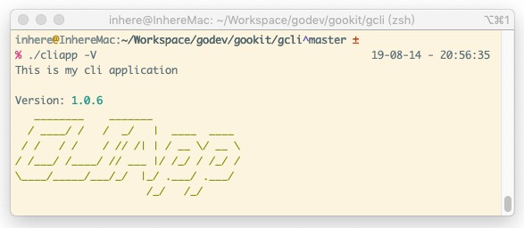
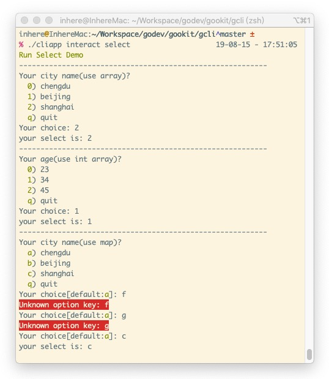
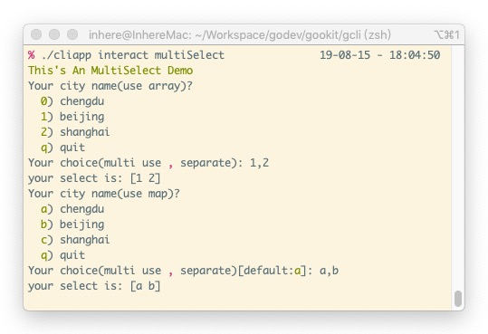
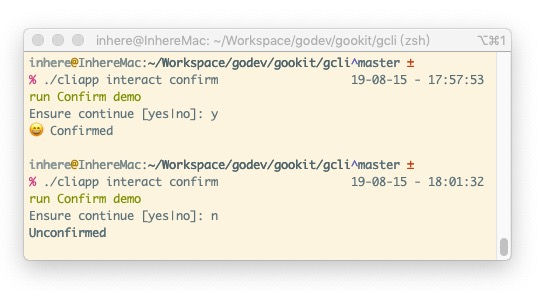

# GCli 

[](https://github.com/gookit/gcli)
[](https://travis-ci.org/gookit/gcli)
[](https://app.codacy.com/app/inhere/gcli?utm_source=github.com&utm_medium=referral&utm_content=gookit/gcli&utm_campaign=Badge_Grade_Dashboard)
[](https://godoc.org/github.com/gookit/gcli)
[](https://goreportcard.com/report/github.com/gookit/gcli)
[](https://coveralls.io/github/gookit/gcli?branch=master)

A simple to use command line application, written using golang.

> **[中文说明](README.zh-CN.md)**

## Screenshots


## Features

- Simple to use
- Support for adding multiple commands and supporting command aliases
- When the command entered is incorrect, a similar command will be prompted(including an alias prompt)
- Support option binding `--long`, support for adding short options(`-s`)
- POSIX-style short flag combining (`-a -b` = `-ab`).
- Support binding argument to specified name, support `required`, optional, `array` three settings
  - It will be automatically detected and collected when the command is run.
- Supports rich color output. powered by [gookit/color](https://github.com/gookit/color)
  - Supports html tab-style color rendering, compatible with Windows
  - Built-in `info, error, success, danger` and other styles, can be used directly
- Built-in user interaction methods: `ReadLine`, `Confirm`, `Select`, `MultiSelect` ...
- Built-in progress display methods: `Txt`, `Bar`, `Loading`, `RoundTrip`, `DynamicText` ...
- Automatically generate command help information and support color display
- Supports generation of `zsh` and `bash` command completion script files
- Supports a single command as a stand-alone application

## GoDoc

- [godoc for gopkg](https://godoc.org/gopkg.in/gookit/gcli.v2)
- [godoc for github](https://godoc.org/github.com/gookit/gcli)

## Quick start

```bash
import "gopkg.in/gookit/gcli.v2" // is recommended
// or
import "github.com/gookit/gcli"
// for go mod
import "github.com/gookit/gcli/v2"
```

```go 
package main

import (
    "runtime"
    "github.com/gookit/gcli/v2"
    "github.com/gookit/gcli/v2/_examples/cmd"
)

// for test run: go build ./_examples/cliapp.go && ./cliapp
func main() {
    runtime.GOMAXPROCS(runtime.NumCPU())

    app := gcli.NewApp()
    app.Version = "1.0.3"
    app.Description = "this is my cli application"
    // app.SetVerbose(gcli.VerbDebug)

    app.Add(cmd.ExampleCommand())
    app.Add(&gcli.Command{
        Name: "demo",
        // allow color tag and {$cmd} will be replace to 'demo'
        UseFor: "this is a description <info>message</> for {$cmd}", 
        Aliases: []string{"dm"},
        Func: func (cmd *gcli.Command, args []string) error {
            gcli.Print("hello, in the demo command\n")
            return 0
        },
    })

    // .... add more ...

    app.Run()
}
```

## Usage

- build a demo package 

```bash
% go build ./_examples/cliapp.go                                                           
```

### Display version

```bash
% ./cliapp --version      
# or use -V                                                 
% ./cliapp -V                                                     
```



### Display app help

> by `./cliapp` or `./cliapp -h` or `./cliapp --help`

Examples:

```bash
./cliapp
./cliapp -h # can also
./cliapp --help # can also
```


### Run A Command

```bash
% ./cliapp example -c some.txt -d ./dir --id 34 -n tom -n john val0 val1 val2 arrVal0 arrVal1 arrVal2
```

you can see:


### Display Command Help

> by `./cliapp example -h` or `./cliapp example --help`


### Error Command Tips


### Generate Auto Completion Scripts

```go
import  "github.com/gookit/gcli/v2/builtin"

    // ...
    // add gen command(gen successful you can remove it)
    app.Add(builtin.GenAutoCompleteScript())

```

Build and run command(_This command can be deleted after success._)：

```bash
% go build ./_examples/cliapp.go && ./cliapp genac -h // display help
% go build ./_examples/cliapp.go && ./cliapp genac // run gen command
```

will see:

```text
INFO: 
  {shell:zsh binName:cliapp output:auto-completion.zsh}

Now, will write content to file auto-completion.zsh
Continue? [yes|no](default yes): y

OK, auto-complete file generate successful
```

> After running, it will generate an `auto-completion.{zsh|bash}` file in the current directory,
 and the shell environment name is automatically obtained.
 Of course you can specify it manually at runtime

Generated shell script file ref： 

- bash env [auto-completion.bash](resource/auto-completion.bash) 
- zsh env [auto-completion.zsh](resource/auto-completion.zsh)

Preview: 


## Write a command

### About argument definition

- Required argument cannot be defined after optional argument
- Only one array parameter is allowed
- The (array) argument of multiple values ​​can only be defined at the end

### Simple use

```go
app.Add(&gcli.Command{
    Name: "demo",
    // allow color tag and {$cmd} will be replace to 'demo'
    UseFor: "this is a description <info>message</> for command", 
    Aliases: []string{"dm"},
    Func: func (cmd *gcli.Command, args []string) error {
        gcli.Print("hello, in the demo command\n")
        return nil
    },
})
```

### Write go file

> the source file at: [example.go](_examples/cmd/example.go)

```go
package cmd

import (
	"fmt"
	"github.com/gookit/color"
	"github.com/gookit/gcli/v2"
)

// options for the command
var exampleOpts = struct {
	id  int
	c   string
	dir string
	opt string
	names gcli.Strings
}{}

// ExampleCommand command definition
func ExampleCommand() *gcli.Command {
	cmd := &gcli.Command{
		Name:        "example",
		UseFor: "this is a description message",
		Aliases:     []string{"exp", "ex"},
		Func:          exampleExecute,
		// {$binName} {$cmd} is help vars. '{$cmd}' will replace to 'example'
		Examples: `{$binName} {$cmd} --id 12 -c val ag0 ag1
  <cyan>{$fullCmd} --names tom --names john -n c</> test use special option`,
	}

	// bind options
	cmd.IntOpt(&exampleOpts.id, "id", "", 2, "the id option")
	cmd.StrOpt(&exampleOpts.c, "config", "c", "value", "the config option")
	// notice `DIRECTORY` will replace to option value type
	cmd.StrOpt(&exampleOpts.dir, "dir", "d", "", "the `DIRECTORY` option")
	// setting option name and short-option name
	cmd.StrOpt(&exampleOpts.opt, "opt", "o", "", "the option message")
	// setting a special option var, it must implement the flag.Value interface
	cmd.VarOpt(&exampleOpts.names, "names", "n", "the option message")

	// bind args with names
	cmd.AddArg("arg0", "the first argument, is required", true)
	cmd.AddArg("arg1", "the second argument, is required", true)
	cmd.AddArg("arg2", "the optional argument, is optional")
	cmd.AddArg("arrArg", "the array argument, is array", false, true)

	return cmd
}

// command running
// example run:
// 	go run ./_examples/cliapp.go ex -c some.txt -d ./dir --id 34 -n tom -n john val0 val1 val2 arrVal0 arrVal1 arrVal2
func exampleExecute(c *gcli.Command, args []string) error {
	fmt.Print("hello, in example command\n")
	
	magentaln := color.Magenta.Println

	magentaln("All options:")
	fmt.Printf("%+v\n", exampleOpts)
	magentaln("Raw args:")
	fmt.Printf("%v\n", args)

	magentaln("Get arg by name:")
	arr := c.Arg("arrArg")
	fmt.Printf("named array arg '%s', value: %v\n", arr.Name, arr.Value)

	magentaln("All named args:")
	for _, arg := range c.Args() {
		fmt.Printf("named arg '%s': %+v\n", arg.Name, *arg)
	}

	return nil
}
```

- display the command help：

```bash
go build ./_examples/cliapp.go && ./cliapp example -h
```


## Progress display
 
- `progress.Bar` progress bar


- `progress.Txt` text progress bar

```text
Data handling ... ... 50% (25/50)
```

- `progress.LoadBar` pending/loading progress bar


- `progress.Counter` counter 
- `progress.RoundTrip` round trip progress bar

```text
[===     ] -> [    === ] -> [ ===    ]
```


- `progress.DynamicText` dynamic text message

Examples:

```go
package main

import "time"
import "github.com/gookit/gcli/v2/progress"

func main()  {
	speed := 100
	maxSteps := 110
	p := progress.Bar(maxSteps)
	p.Start()

	for i := 0; i < maxSteps; i++ {
		time.Sleep(time.Duration(speed) * time.Millisecond)
		p.Advance()
	}

	p.Finish()
}
```

> more demos please see [progress_demo.go](_examples/cmd/progress_demo.go)

run demos:

```bash
go run ./_examples/cliapp.go prog txt
go run ./_examples/cliapp.go prog bar
go run ./_examples/cliapp.go prog roundTrip
```


## Interactive methods
   
console interactive methods

- `interact.ReadInput`
- `interact.ReadLine`
- `interact.ReadFirst`
- `interact.Confirm`
- `interact.Select/Choice`
- `interact.MultiSelect/Checkbox`
- `interact.Question/Ask`
- `interact.ReadPassword`

Examples:

```go
package main

import "fmt"
import "github.com/gookit/gcli/v2/interact"

func main() {
	username, _ := interact.ReadLine("Your name?")
	password := interact.ReadPassword("Your password?")
	
	ok := interact.Confirm("ensure continue?")
	if !ok {
		// do something...
	}
    
	fmt.Printf("username: %s, password: %s\n", username, password)
}
```

### Read Input

```go
ans, _ := interact.ReadLine("Your name? ")

if ans != "" {
    color.Println("Your input: ", ans)
} else {
    color.Cyan.Println("No input!")
}
```


### Select/Choice

```go
	ans := interact.SelectOne(
		"Your city name(use array)?",
		[]string{"chengdu", "beijing", "shanghai"},
		"",
	)
	color.Comment.Println("your select is: ", ans)
```



### Multi Select/Checkbox

```go
	ans := interact.MultiSelect(
		"Your city name(use array)?",
		[]string{"chengdu", "beijing", "shanghai"},
		nil,
	)
	color.Comment.Println("your select is: ", ans)
```



### Confirm Message

```go
	if interact.Confirm("Ensure continue") {
		fmt.Println(emoji.Render(":smile: Confirmed"))
	} else {
		color.Warn.Println("Unconfirmed")
	}
```



### Read Password

```go
	pwd := interact.ReadPassword()

	color.Comment.Println("your input password is: ", pwd)
```


## CLI Color

### Color output display


### Usage

```go
package main

import (
    "github.com/gookit/color"
)

func main() {
	// simple usage
	color.Cyan.Printf("Simple to use %s\n", "color")

	// internal theme/style:
	color.Info.Tips("message")
	color.Info.Prompt("message")
	color.Info.Println("message")
	color.Warn.Println("message")
	color.Error.Println("message")
	
	// custom color
	color.New(color.FgWhite, color.BgBlack).Println("custom color style")

	// can also:
	color.Style{color.FgCyan, color.OpBold}.Println("custom color style")
	
	// use defined color tag
	color.Print("use color tag: <suc>he</><comment>llo</>, <cyan>wel</><red>come</>\n")

	// use custom color tag
	color.Print("custom color tag: <fg=yellow;bg=black;op=underscore;>hello, welcome</>\n")

	// set a style tag
	color.Tag("info").Println("info style text")

	// prompt message
	color.Info.Prompt("prompt style message")
	color.Warn.Prompt("prompt style message")

	// tips message
	color.Info.Tips("tips style message")
	color.Warn.Tips("tips style message")
}
```

### More usage

#### Basic color

> support on windows `cmd.exe`

- `color.Bold`
- `color.Black`
- `color.White`
- `color.Gray`
- `color.Red`
- `color.Green`
- `color.Yellow`
- `color.Blue`
- `color.Magenta`
- `color.Cyan`

```go
color.Bold.Println("bold message")
color.Yellow.Println("yellow message")
```

#### Extra themes

> support on windows `cmd.exe`

- `color.Info`
- `color.Note`
- `color.Light`
- `color.Error`
- `color.Danger`
- `color.Notice`
- `color.Success`
- `color.Comment`
- `color.Primary`
- `color.Warning`
- `color.Question`
- `color.Secondary`

```go
color.Info.Println("Info message")
color.Success.Println("Success message")
```

#### Use like html tag

> **not** support on windows `cmd.exe`

```go
// use style tag
color.Print("<suc>he</><comment>llo</>, <cyan>wel</><red>come</>")
color.Println("<suc>hello</>")
color.Println("<error>hello</>")
color.Println("<warning>hello</>")

// custom color attributes
color.Print("<fg=yellow;bg=black;op=underscore;>hello, welcome</>\n")
```

> **For more information on the use of color libraries, please visit [gookit/color](https://github.com/gookit/color)**

## Gookit packages

- [gookit/ini](https://github.com/gookit/ini) Go config management, use INI files
- [gookit/rux](https://github.com/gookit/rux) Simple and fast request router for golang HTTP 
- [gookit/gcli](https://github.com/gookit/gcli) build CLI application, tool library, running CLI commands
- [gookit/event](https://github.com/gookit/event) Lightweight event manager and dispatcher implements by Go
- [gookit/cache](https://github.com/gookit/cache) Generic cache use and cache manager for golang. support File, Memory, Redis, Memcached.
- [gookit/config](https://github.com/gookit/config) Go config management. support JSON, YAML, TOML, INI, HCL, ENV and Flags
- [gookit/color](https://github.com/gookit/color) A command-line color library with true color support, universal API methods and Windows support
- [gookit/filter](https://github.com/gookit/filter) Provide filtering, sanitizing, and conversion of golang data
- [gookit/validate](https://github.com/gookit/validate) Use for data validation and filtering. support Map, Struct, Form data
- [gookit/goutil](https://github.com/gookit/goutil) Some utils for the Go: string, array/slice, map, format, cli, env, filesystem, test and more
- More please see https://github.com/gookit

## See also

- `inhere/console` https://github/inhere/php-console
- `issue9/term` https://github.com/issue9/term
- `beego/bee` https://github.com/beego/bee
- [ANSI escape code](https://en.wikipedia.org/wiki/ANSI_escape_code)

## License

MIT
